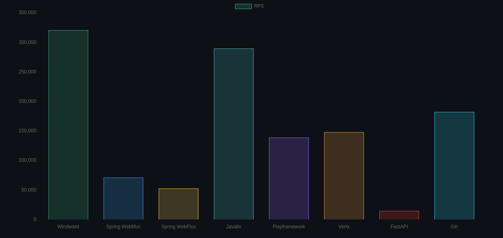

# Windward


Light web framework for Java
<div>
    
</div>

## Quick start

### Add maven dependency

```xml

<dependency>
    <groupId>org.flmelody</groupId>
    <artifactId>windward</artifactId>
    <version>1.5.0-RELEASE</version>
</dependency>
```

use jackson

```xml

<dependency>
    <groupId>com.fasterxml.jackson.core</groupId>
    <artifactId>jackson-databind</artifactId>
    <version>2.16.1</version>
</dependency>
```

or gson

```xml

<dependency>
    <groupId>com.google.code.gson</groupId>
    <artifactId>gson</artifactId>
    <version>2.10.1</version>
</dependency>
```

### Coding

```java
public class Application {
    public static void main(String[] args) {
        // started at 8080 default
        Windward.setup().get("/", () -> "Hello World!").run();
    }
}

```

Everything is fine!😇

### Benchmark


