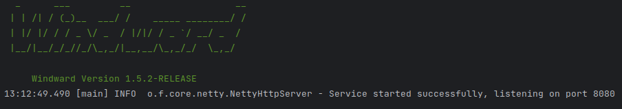

# Windward


[中文](README.zh-CN.md)

Light web framework for Java
<div>
    
</div>

## Quick start

### Add maven dependency

```xml

<dependency>
    <groupId>org.flmelody</groupId>
    <artifactId>windward</artifactId>
    <version>1.5.3-RELEASE</version>
</dependency>
```

use jackson

```xml

<dependency>
    <groupId>com.fasterxml.jackson.core</groupId>
    <artifactId>jackson-databind</artifactId>
    <version>2.17.1</version>
</dependency>
```

or gson

```xml

<dependency>
    <groupId>com.google.code.gson</groupId>
    <artifactId>gson</artifactId>
    <version>2.10.1</version>
</dependency>
```

Add Logback

```xml

<dependency>
    <groupId>ch.qos.logback</groupId>
    <artifactId>logback-classic</artifactId>
    <version>1.3.14</version>
</dependency>
```

`logback.xml`

```xml

<configuration>
    <appender name="CONSOLE" class="ch.qos.logback.core.ConsoleAppender">
        <layout class="ch.qos.logback.classic.PatternLayout">
            <Pattern>
                %d{HH:mm:ss.SSS} [%t] %-5level %logger{36} - %msg%n
            </Pattern>
        </layout>
    </appender>
    <statusListener class="ch.qos.logback.core.status.NopStatusListener"/>
    <logger name="org.flmelody" level="info" additivity="false">
        <appender-ref ref="CONSOLE"/>
    </logger>
    <!--add your package name-->
    <!--    <logger name="your package" level="info" additivity="false">
            <appender-ref ref="CONSOLE"/>
        </logger>-->

    <root level="error">
        <appender-ref ref="CONSOLE"/>
    </root>

</configuration>
```

### Run

```java
public class Application {
    public static void main(String[] args) {
        // started at 8080 default
        Windward.setup().get("/", () -> "Hello World!").run();
    }
}

```

Everything is fine ! 😇, You'll see something like below



### Benchmark


